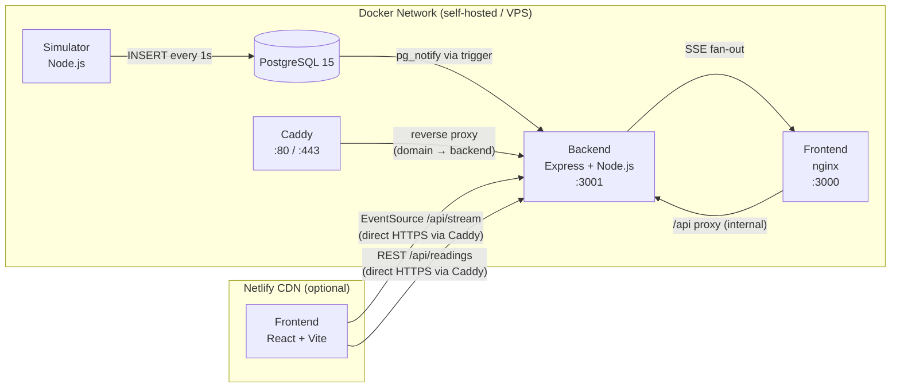

# Architecture

## Block Diagram



**Two deployment modes:**

| Mode         | Frontend              | Backend access              |
|--------------|-----------------------|-----------------------------|
| Local Docker | nginx at `:3000`      | nginx proxies `/api/` internally |
| VPS + Netlify | Netlify CDN          | Caddy HTTPS at `$DOMAIN`    |

## Sequence: Speed Update

```
Simulator       PostgreSQL        Backend           Browser
    |                |                |                 |
    |-- INSERT ----→ |                |                 |
    |                |-- NOTIFY ----→ |                 |
    |                |                |-- SSE write --→ |
    |                |                |  (speed_update) |
    |                |                |                 |-- animate gauge
```

## Design Decisions

### Why pg_notify instead of polling?
PostgreSQL's built-in LISTEN/NOTIFY is zero-latency and zero-overhead. There is no polling loop anywhere in the system — the event propagates from INSERT to browser render in < 10 ms on a local network.

### Why a dedicated pg.Client for LISTEN?
pg.Pool recycles connections. A recycled connection silently loses its LISTEN registration. The listener uses a standalone client with exponential backoff reconnection so LISTEN survives any transient DB restart.

### Why SSE instead of WebSocket?
SSE is unidirectional (server → client), which matches this use-case exactly. It works over plain HTTP/1.1, is trivially proxied by nginx, and has built-in browser reconnection semantics. WebSockets would add complexity with no benefit here.

### Why canvas for the gauge?
DOM-based SVG gauges with many animated elements can drop frames. A single `<canvas>` element with a requestAnimationFrame loop gives full control over render timing and GPU compositing, resulting in smooth 60 fps animation.

### Why Recharts for the chart?
Recharts is React-native (no d3 import overhead) and handles the rolling window of 60 readings with `isAnimationActive={false}` for performance — we animate the gauge, not the chart.

### Why nginx for the frontend container?
The frontend is a static build (HTML + JS + CSS) with no server-side logic. nginx:alpine serves it in < 25 MB and handles three things in one config: SPA fallback (`try_files`), `/api/` reverse proxy to the backend (no CORS needed inside the Docker network), and the critical `proxy_buffering off` directive for the SSE stream route.

### Why Caddy for HTTPS on VPS?
Caddy auto-provisions TLS certificates via ACME/Let's Encrypt with zero manual configuration — a single `Caddyfile` pointing `{$DOMAIN}` at `backend:3001` is all that is needed. HTTP-to-HTTPS redirect is built in. This eliminates the certbot renewal cron job required with nginx + Let's Encrypt and reduces operational surface area on self-hosted deployments.

### Why layered architecture instead of MVC?
MVC assumes a view layer rendered by the server. This backend is a pure API (no views), so the pattern used is **Layered Architecture with the Repository pattern**:

```
routes/        → declare paths only, import controller functions
controllers/   → own req/res logic, call services or repositories
services/      → business logic (SSE fan-out, pg LISTEN lifecycle)
repositories/  → all SQL isolated here; accepts optional pool for testability
db/            → pg Pool singleton + dedicated LISTEN client
constants.ts   → single source for all env-backed defaults
```

`notificationService` exports `startNotificationService()` rather than calling
`createListener()` on module load — so the module can be imported in tests without
opening a live DB connection. `server.ts` calls it explicitly during startup, making
the wiring visible and auditable.

This makes each layer independently testable and prevents SQL from leaking into route or controller files.

## Deployment Topology

### Local Docker (all-in-one)

```
┌──────────────────────────────────────────┐
│  docker-compose up                        │
│                                           │
│  ┌──────────┐   ┌──────────────────────┐  │
│  │ postgres │   │      backend         │  │
│  │ internal │   │     internal:3001    │  │
│  └──────────┘   └──────────────────────┘  │
│  ┌──────────┐   ┌──────────────────────┐  │
│  │simulator │   │  frontend (nginx)    │  │
│  │ internal │   │       :3000          │◄─┼── http://localhost:3000
│  └──────────┘   └──────────────────────┘  │
│  ┌──────────┐                             │
│  │  Caddy   │  :80/:443 (VPS only)        │
│  └──────────┘                             │
└──────────────────────────────────────────┘
```

### VPS + Netlify (production)

```
┌─────────────────────────────────────┐
│         VPS / Cloud Host            │
│  docker-compose up                  │
│                                     │
│  ┌──────────┐  ┌──────────────────┐ │
│  │ postgres │  │     backend      │ │
│  │ internal │  │  internal:3001   │ │
│  └──────────┘  └──────────────────┘ │
│  ┌──────────┐                       │
│  │simulator │                       │
│  └──────────┘                       │
│  ┌──────────┐                       │
│  │  Caddy   │◄── HTTPS :80/:443     │
│  └──────────┘  ($DOMAIN → backend) │
└─────────────────────────────────────┘

┌─────────────────────────────────────┐
│           Netlify CDN               │
│  npm run build (Vite)               │
│  Static files + SPA fallback        │
│  VITE_API_URL → https://$DOMAIN     │
└─────────────────────────────────────┘
```
